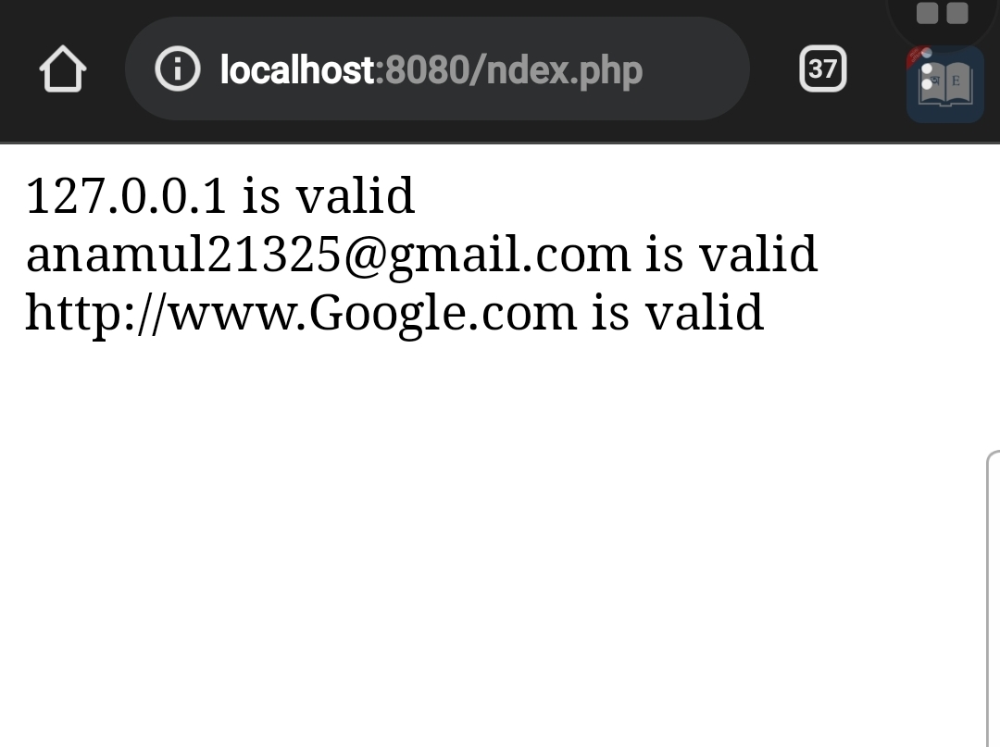

# Filter  

## FILTER_SANITIZE_STRING  

```php
<?php
//filter
$str ="<h1>hi I am checking h1 tag</h1>";
$str_filter=filter_var($str,FILTER_SANITIZE_STRING);
echo("filter after = $str_filter");
?>

```  

## FILTER_VALIDATE_EMAI  

```php
<?php
//filter
$email="anamul21325@gmail.com";
if(filter_var($email, FILTER_VALIDATE_EMAIL)){
echo($email." is valid");
}else{
echo $email." is not valid";
}
?>

```  

## FILTER_VALIDATE_IP  

```php  
<?php
//filter
$ip ="127.0.0.1";
if(filter_var($ip, FILTER_VALIDATE_IP)){
echo($ip." is valid");
}else{
echo $ip." is not valid";
}
?>

```  

## FILTER_VALIDATE_URL  

```php  
<?php
//filter
$url ="http://www.Google.com";
if(filter_var($url, FILTER_VALIDATE_URL)){
echo($url." is valid");
}else{
echo $url." is not valid";
}
?>

```


## total page    ip, email,url  

```php

<?php
//filter
$ip ="127.0.0.1";
if(filter_var($ip, FILTER_VALIDATE_IP)){
echo($ip." is valid");
}else{
echo $ip." is not valid";
}
?>
<br/>
<?php
//filter
$email="anamul21325@gmail.com";
if(filter_var($email, FILTER_VALIDATE_EMAIL)){
echo($email." is valid");
}else{
echo $email." is not valid";
}
?>
<br/>


<?php
//filter
$url ="http://www.Google.com";
if(filter_var($url, FILTER_VALIDATE_URL)){
echo($url." is valid");
}else{
echo $url." is not valid";
}
?>

```

### results/output  


